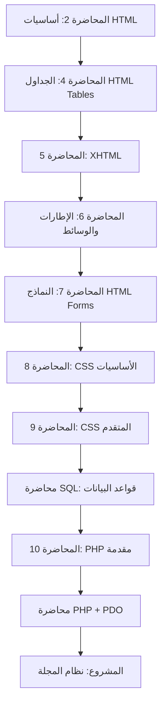
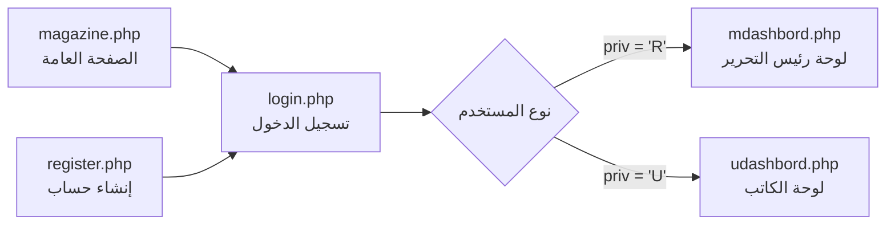
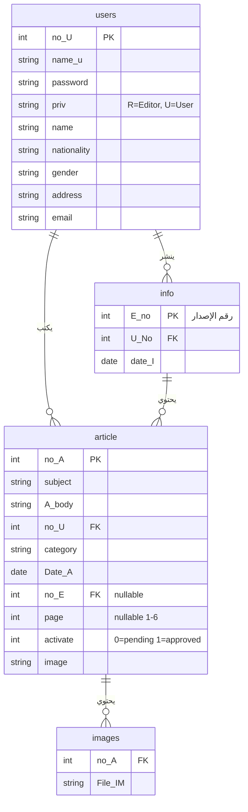

# 📚 تحليل شامل لمنهج مادة برمجة مواقع الإنترنت (CS 315)

> [!IMPORTANT]
> تم دراسة **85 ملفاً** بالكامل: أكواد PHP/HTML/CSS، عروض تقديمية، مستندات SQL، صور محاضرات، وملف التكليف (Assignment).

---

## 🗺️ الخريطة العامة للمنهج

المنهج مُقسّم إلى **10 محاضرات رئيسية** + مشروع تطبيقي (نظام مجلة إلكترونية)، ويغطي الرحلة الكاملة من أساسيات HTML حتى بناء تطبيق ويب متكامل بـ PHP و MySQL.

---

## 📖 تفصيل المحاضرات

### 1️⃣ المحاضرة 2 — أساسيات HTML
- **الملف**: [lecture2.ppt](file:///c:/Users/acer/Desktop/web..315/lecture2.ppt)
- **المحتوى**: هيكل صفحة HTML الأساسي، الوسوم الأساسية (`<html>`, `<head>`, `<body>`)، العناوين، الفقرات، القوائم المرتبة وغير المرتبة
- **الصور الداعمة**: تمارين على القوائم المتداخلة (جامعة طرابلس - الكليات والأقسام)

### 2️⃣ المحاضرة 4 — الجداول (HTML Tables)
- **الملف**: [Lecture 4_no_font.pptx](file:///c:/Users/acer/Desktop/web..315/Lecture%204_no_font.pptx)
- **المحتوى**: إنشاء جداول HTML، خصائص `border`, `WIDTH`, `bgcolor`, `bordercolor`, `ALIGN`
- **الصور**: أمثلة تطبيقية مثل جدول السرعات على الطرق (colspan, rowspan متقدم)
- **الأمثلة**: `thead`, `tbody`, `tfoot` مع تلوين كل قسم

### 3️⃣ المحاضرة 5 — XHTML
- **الملف**: [Lecture 5.ppt](file:///c:/Users/acer/Desktop/web..315/Lecture%205.ppt)
- **المحتوى**: الفروقات بين HTML و XHTML، قواعد الكتابة الصارمة، DOCTYPE declarations

### 4️⃣ المحاضرة 6 — الإطارات والوسائط
- **الملف**: [Lecture 6_no_marquee.ppt](file:///c:/Users/acer/Desktop/web..315/Lecture%206_no_marquee.ppt)
- **المحتوى**: Frames, iframes, multimedia embedding, marquee element

### 5️⃣ المحاضرة 7 — نماذج HTML (Forms)
- **الملف**: [lecture7.ppt](file:///c:/Users/acer/Desktop/web..315/lecture7.ppt)
- **المحتوى الأساسي**:
  - `<form>` مع `method="post"` و `method="get"`
  - أنواع `<input>`: text, password, radio, checkbox, submit
  - `<datalist>` للإكمال التلقائي
  - `<label>` مع `for` attribute
  - `maxlength`, `size`, `value`, `checked` attributes
- **الصور الداعمة**: أمثلة عملية لنموذج إدخال الاسم، checkbox، radio buttons، datalist

### 6️⃣ المحاضرة 8 — CSS الأساسيات
- **الملف**: [lecture 8.ppt](file:///c:/Users/acer/Desktop/web..315/lecture%208.ppt)
- **المحتوى**:
  - **المحددات (Selectors)**: ID (`#para1`), Class (`.center`), Element
  - **خصائص أساسية**: `color`, `text-align`, `background-color`, `background-image`
  - **فئات الروابط (Classes)**: `a.veg`, `a.fru` مع ألوان مختلفة
- **الأمثلة التطبيقية**:
  - [round.html](file:///c:/Users/acer/Desktop/web..315/round.html) — حواف مستديرة أساسية
  - [round_2.html](file:///c:/Users/acer/Desktop/web..315/round_2.html) — 4 قيم مختلفة لكل زاوية
  - [round_3.html](file:///c:/Users/acer/Desktop/web..315/round_3.html) — حواف بيضاوية ودائرية
  - [rounded_buttons_cs3.html](file:///c:/Users/acer/Desktop/web..315/rounded_buttons_cs3.html) — أزرار بحواف متدرجة
  - [page_design_div.html](file:///c:/Users/acer/Desktop/web..315/page_design_div.html) — تصميم صفحة كاملة بـ div
- **ملفات PDF إضافية**: [css_display1.pdf](file:///c:/Users/acer/Desktop/web..315/css_display1.pdf) — خاصية display

### 7️⃣ المحاضرة 9 — CSS المتقدم
- **الملف**: [lecture 9 .ppt](file:///c:/Users/acer/Desktop/web..315/lecture%209%20.ppt)
- **المحتوى**:
  - **Pseudo-classes**: `:link`, `:visited`, `:hover`, `:active`, `:first-child`
  - **تنسيق الروابط المتقدم**: تغيير الخط، حجم الخط، خلفية، إزالة التسطير
  - **Navigation bars**: أفقية وعمودية
- **الأمثلة التطبيقية**:
  - [Dropdown_Menu_Navigation_Bar.html](file:///c:/Users/acer/Desktop/web..315/Dropdown_Menu_Navigation_Bar.html) — قائمة منسدلة كاملة
  - [pagination_next.html](file:///c:/Users/acer/Desktop/web..315/pagination_next.html) — ترقيم الصفحات

### 8️⃣ مقدمة SQL
- **الملف**: [introduction_sql.ppt](file:///c:/Users/acer/Desktop/web..315/introduction_sql.ppt)
- **مستندات تفصيلية**:
  - [The SQL SELECT Statement.doc](file:///c:/Users/acer/Desktop/web..315/The%20SQL%20SELECT%20Statement.doc) — استعلامات الاستعراض
  - [SQL INSERT INTO Example.doc](file:///c:/Users/acer/Desktop/web..315/SQL%20INSERT%20INTO%20Example.doc) — الإدخال
  - [SQL UPDATE Example.doc](file:///c:/Users/acer/Desktop/web..315/SQL%20UPDATE%20Example.doc) — التحديث
  - [The DELETE Statement.doc](file:///c:/Users/acer/Desktop/web..315/The%20DELETE%20Statement.doc) — الحذف

### 9️⃣ المحاضرة 10 — مقدمة PHP
- **الملفات**: [lecture_10.ppt](file:///c:/Users/acer/Desktop/web..315/lecture_10.ppt) + [INTRODUCTION TO PHP.ppt](file:///c:/Users/acer/Desktop/web..315/INTRODUCTION%20TO%20PHP.ppt)
- **المحتوى**:
  - أساسيات PHP: المتغيرات، الشروط، الحلقات، الدوال
  - معالجة النماذج: `$_GET`, `$_POST`
  - Multiple form selections مع المصفوفات
  - Cookies: `setcookie()`, `$_COOKIE`
  - رفع الملفات: `$_FILES`, `move_uploaded_file()`
  - Redirections: `header("Location: ...")`
- **ملفات إضافية**:
  - [validation.pdf](file:///c:/Users/acer/Desktop/web..315/validation.pdf) — التحقق من المدخلات
  - [Regular Expressions2016_php.pdf](file:///c:/Users/acer/Desktop/web..315/Regular%20Expressions2016_php.pdf) — التعبيرات النمطية

### 🔟 PHP + PDO (قواعد البيانات)
- **الملف**: [pdo_database.pptx](file:///c:/Users/acer/Desktop/web..315/pdo_database.pptx)
- **أكواد تطبيقية كاملة (CRUD)**:

| العملية | الملف | الوصف |
|---------|-------|-------|
| الاتصال | [connection_pdo.php](file:///c:/Users/acer/Desktop/web..315/connection_pdo.php) | إنشاء اتصال PDO مع try-catch |
| الاتصال 2 | [db.php](file:///c:/Users/acer/Desktop/web..315/db.php) | اتصال مختصر لقاعدة magazine |
| الإدخال | [insert_pdo.php](file:///c:/Users/acer/Desktop/web..315/insert_pdo.php) | نموذج إدخال + datalist ديناميكي |
| البحث | [fun_search_pdo.php](file:///c:/Users/acer/Desktop/web..315/fun_search_pdo.php) | 4 دوال بحث (select, radio, checkbox, datalist) |
| التحديث | [updat_pdo.php](file:///c:/Users/acer/Desktop/web..315/updat_pdo.php) | بحث → اختيار → تعديل → حفظ |
| الحذف | [delete_pdo.php](file:///c:/Users/acer/Desktop/web..315/delete_pdo.php) | بحث → اختيار متعدد → حذف |

---

## 🏗️ المشروع التطبيقي — نظام المجلة الإلكترونية

### هيكل النظام

### قاعدة البيانات (magazine)

### ملفات المشروع

| الملف | الحجم | الوظيفة |
|-------|-------|---------|
| [login.php](file:///c:/Users/acer/Desktop/web..315/login.php) | 2.3KB | تسجيل دخول مع validation مزدوج (JS + PHP) + توجيه حسب الصلاحية |
| [register.php](file:///c:/Users/acer/Desktop/web..315/register.php) | 4.8KB | تسجيل مستخدم جديد مع 7 حقول + validation شاملة + فحص البريد المكرر |
| [magazine.php](file:///c:/Users/acer/Desktop/web..315/magazine.php) | 6.4KB | عرض المجلة العامة: تصفح الأعداد + 6 صفحات + بحث بالعنوان/التصنيف |
| [udashbord.php](file:///c:/Users/acer/Desktop/web..315/udashbord.php) | 12.9KB | لوحة الكاتب: إضافة/تعديل/حذف مقالات + رفع صور متعددة + فلترة |
| [mdashbord.php](file:///c:/Users/acer/Desktop/web..315/mdashbord.php) | 11.4KB | لوحة رئيس التحرير: موافقة/رفض + نشر إصدار (12 مقال = 6 صفحات × 2) |
| [style.css](file:///c:/Users/acer/Desktop/web..315/style.css) | 7.2KB | التصميم الموحد: gradient background, cards, buttons, responsive |
| [db.php](file:///c:/Users/acer/Desktop/web..315/db.php) | 298B | ملف الاتصال بقاعدة البيانات |

### الأداة التعليمية التفاعلية
| الملف | الوظيفة |
|-------|---------|
| [mysqli_vs_pdo.html](file:///c:/Users/acer/Desktop/web..315/mysqli_vs_pdo.html) | مقارنة تفاعلية بين PDO و MySQLi مع شرح تفصيلي + لعبة تحويل أكواد (Quiz) |

---

## 📋 المواضيع الرئيسية المغطاة في المنهج

### الطبقة الأولى: العرض (Frontend)
- ✅ HTML5 Structure & Semantics
- ✅ Tables (thead, tbody, tfoot, colspan, rowspan)
- ✅ Forms (text, password, radio, checkbox, select, datalist, file upload)
- ✅ CSS Selectors (id, class, element, pseudo-classes)
- ✅ CSS Properties (colors, backgrounds, borders, border-radius, display)
- ✅ CSS Layout (float, div-based page design)
- ✅ CSS Navigation (horizontal, vertical, dropdown menus)
- ✅ CSS Pagination
- ✅ Client-side Validation (JavaScript)

### الطبقة الثانية: المنطق (Backend)
- ✅ PHP Basics (variables, conditions, loops, functions)
- ✅ Form Processing ($_GET, $_POST)
- ✅ Sessions (`session_start()`, `$_SESSION`)
- ✅ Cookies (`setcookie()`, `$_COOKIE`)
- ✅ File Upload (`$_FILES`, `move_uploaded_file()`)
- ✅ Redirections (`header("Location: ...")`)
- ✅ Regular Expressions (`preg_match()`)
- ✅ Input Validation (server-side + client-side)
- ✅ `filter_var_array()` مع `FILTER_CALLBACK`, `FILTER_VALIDATE_INT`, `FILTER_VALIDATE_EMAIL`

### الطبقة الثالثة: البيانات (Database)
- ✅ SQL CRUD (SELECT, INSERT, UPDATE, DELETE)
- ✅ PDO Connection with try-catch
- ✅ PDO `exec()`, `query()`, `prepare()`, `execute()`
- ✅ Fetch modes: `FETCH_OBJ`, `FETCH_ASSOC`, `fetchAll()`
- ✅ `rowCount()`, `lastInsertId()`
- ✅ Prepared Statements (with `?` placeholders)
- ✅ JOIN queries (LEFT JOIN, JOIN)

### الطبقة الرابعة: التطبيق المتكامل (Full-Stack Project)
- ✅ نظام تسجيل دخول مع صلاحيات (Role-based access)
- ✅ CRUD كامل مع واجهة مستخدم
- ✅ رفع صور متعددة وربطها بالسجلات
- ✅ نظام موافقة/رفض (Approval workflow)
- ✅ نظام نشر بقواعد (12 مقال = 6 صفحات × 2 مقال)
- ✅ بحث ديناميكي (LIKE queries)
- ✅ ترقيم الصفحات (Pagination)

---

## 📸 الصور التعليمية (47 صورة)

الصور عبارة عن **لقطات شاشة من محاضرات حية (Google Meet)** تظهر:
- أمثلة أكواد HTML مباشرة في المتصفح (view-source)
- أمثلة CSS مباشرة (id selector, class selector, pseudo-classes, links styling)
- أكواد PHP في Notepad++ (forms processing, cookies, file upload, validation, PDO/database operations)
- تمارين عملية باللغة العربية
- المُدرّسة: **omaima** (تشارك الشاشة أثناء الشرح)

---

## ✅ **انتهيت من دراسة المنهج بالكامل!**

أنا الآن مُلمّ تماماً بكل:
1. **ترتيب المحاضرات** ومنطق التدرج فيها
2. **كل سطر كود** في الملفات الـ 14 (PHP/HTML/CSS)
3. **محتوى الصور** الـ 47 (لقطات محاضرات)
4. **مشروع المجلة** بكل تفاصيله (5 ملفات PHP + CSS + قاعدة بيانات)
5. **الأداة التفاعلية** لمقارنة PDO vs MySQLi
6. **ملف التكليف** (Assignment) وملفات SQL ومستندات الـ PDF

> **جاهز لأي طلب**: شرح، أسئلة امتحان، تمارين، تصحيح أكواد، إضافة ميزات، أو أي شيء يتعلق بالمنهج.
